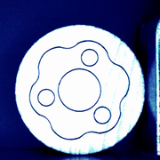
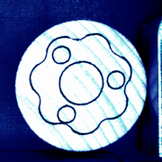

<h1>Industrial-Big-Data-Competition</h1>
全国工业大数据算法竞赛
<h2>更新日志</h2>
<table>
<tr>
<th>版本号</th><th>更新日期</th><th>更新内容</th>
</tr>
<tr>
<td>0.1.0.0</td><td>2021年10月18日</td><td>新增视觉检测模型</td>
</tr>
<tr>
<td>0.1.1.0</td><td>2021年10月18日</td><td>视觉检测pipeline模型去掉边缘检测; 提升视觉检测准确率</td>
</tr>
<tr>
<td>0.1.2.0</td><td>2021年10月18日</td><td>新增误差补偿模型</td>
</tr>
<tr>
<td>0.1.3.0</td><td>2021年10月18日</td><td>视觉检测模型同时输出两个类的预测概率</td>
</tr>
</table>
<h2>项目经验</h2>
<ol>
<li>在分类问题中，如果loss还在下降，而accuracy保持不变，那么不要着急，多训练几轮accuracy就上来了</li>
</ol>
<h2>任务描述</h2>
<h3>分类任务</h3>
<b>合格品</b>
 
<b>不合格品</b>
 
<a href="http://81.70.8.71:8501/v1/models/pic_clf:predict" target="_blank">向此地址发送POST请求</a>
<h3>回归任务</h3>
<b>动态误差实时补偿</b>
<a href="http://81.70.8.71:8501/v1/models/adjustment:predict" target="_blank">向此地址发送POST请求</a>
